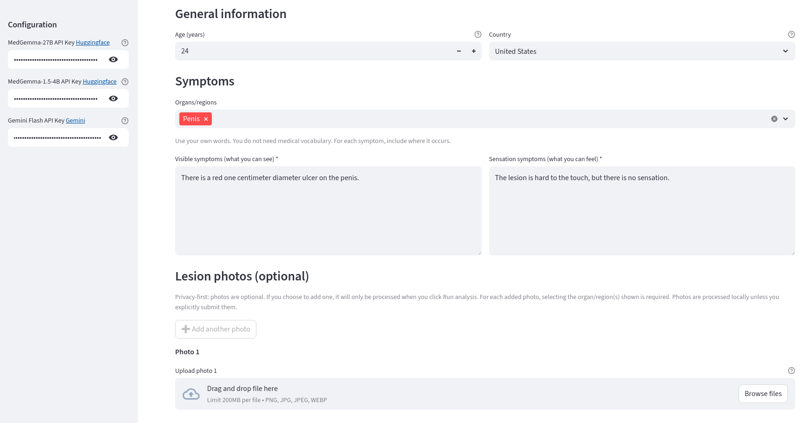
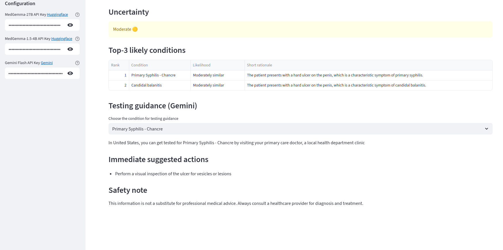
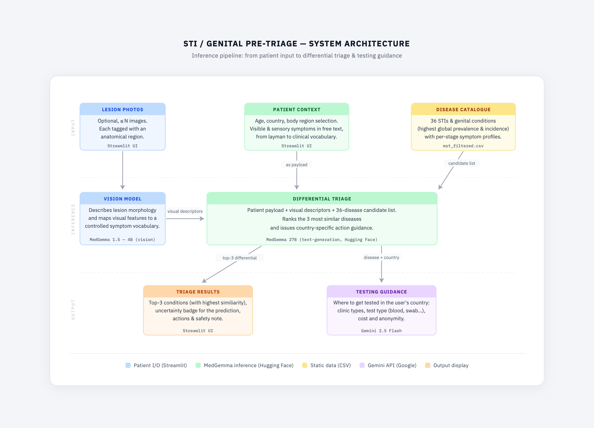

# STI Pre-Triage
## Detecting STI with a few symptoms: a way for shy people to avoid social judgment.

The main goal of this project is to help for the early detection of Sexually Transmissible Disease (STI). Basically, given a few symptoms and maybe a picture, this tool find STI with highest similarity. For each potential disease it then gives council on how to get tested.


## How to run

Clone the project and create an environment
```
git clone https://github.com/pgillibert/STI-Genital-Pre-Triage
cd STI-Genital-Pre-Triage
conda create --name sti-triage python=3.12
conda activate sti-triage
pip install -r requirements.txt
```
Run the app with the command 
```
conda activate sti-triage
streamlit run streamlit.py
```
The app can be used with a browser connecting to `http://localhost:8501/`

In order to use the application, you need to provide access key to various languages models, in the configuration zone. For this you need Huggingface token for accessing [MedGemma-27B](https://huggingface.co/google/medgemma-27b-text-it) and [MedGemma-1.5-4B](https://huggingface.co/google/medgemma-1.5-4b-it). You also need access to google [Gemini API](https://aistudio.google.com/api-keys).

Then enter your age, country, affected area, symptoms:


Click on 'Run analysis (top-3)



## Workflow



